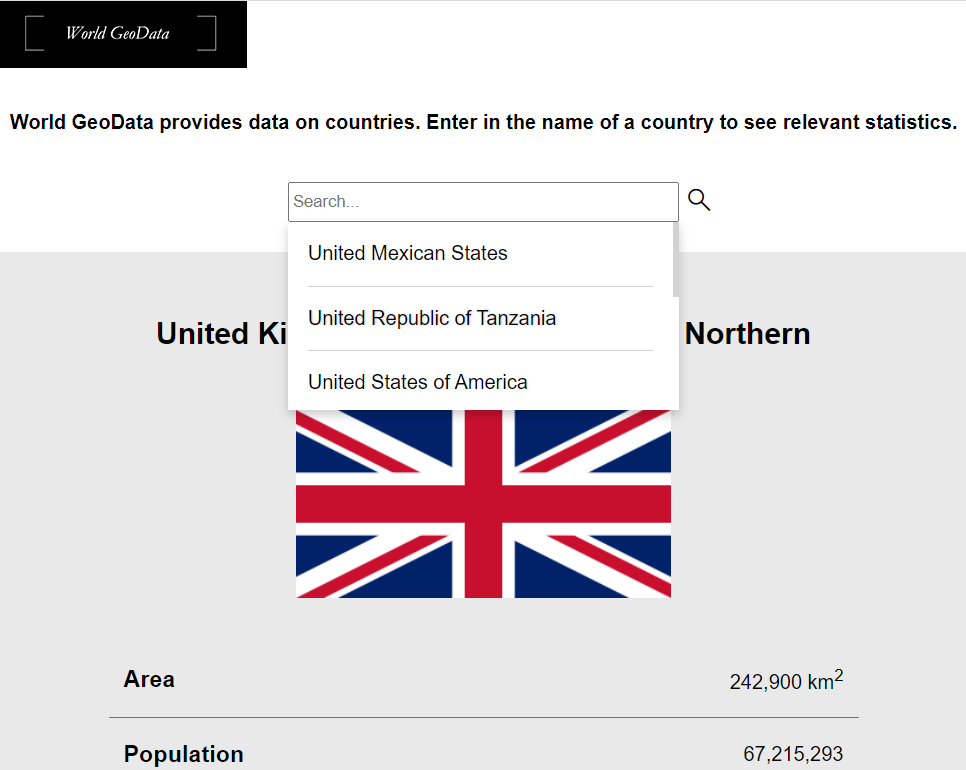
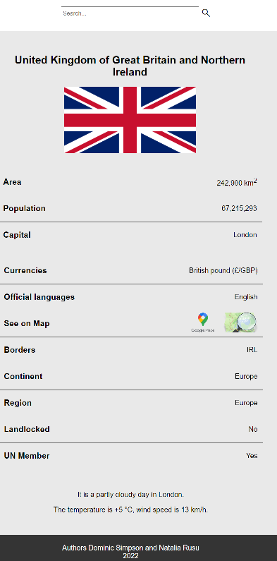
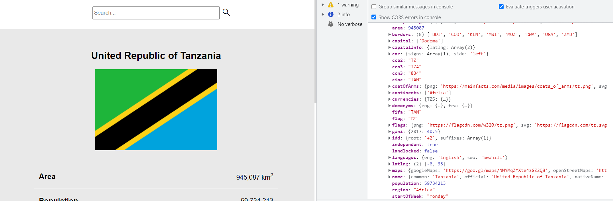

# HTTP
For this project, we had to choose two APIs to get data and display the data on the page.  To get the data from APIs we used javascript fetch API to send the requests and receive responses. We used global fetch() method that provides an easy, logical way to fetch resources asynchronously across the network.  
This project was built with @DominicSimpson 
Our project https://github.com/fac26/Dominic_Natalia_http 
See in action https://fac26.github.io/Dominic_Natalia_http/ 
World GeoData allows a user to search a country's data and provides upon request the data about the country: area, population, language, capital, currencies, borders etc.

## 1. Write code that executes asynchronously

The method getWeather() the word “async” before a function means one simple thing: a function always returns a promise. Other values are wrapped in a resolved promise automatically. So, async ensures that the function returns a promise, and wraps non-promises in it. The keyword await makes JavaScript wait until that promise settles and returns its result. That doesn’t cost any CPU resources, because the JavaScript engine can do other jobs in the meantime: execute other scripts, handle events, etc.

    const getWeather = async (city) => {
      const data = await fetchData(getweatherAPIurl + city);
      if (data.message) {
        //catch block
        weatherEl.innerHTML = `${data.message} weather`;
      } else if(Array.isArray(data)&&data.length===0 || data.temperature==''){//404
        console.log(data)
        weatherEl.innerHTML = 'No data available';
      } else {
        renderWeather(capital, data);
      }
    };

## 2. Use callbacks to access values that aren't available asynchronously
We used renderWeather() callback function in getWeather async function. If there is no data available from API we displayed the appropriate message otherwise we accessed the values from the response and displayed them on the page

    const renderWeather = (city, data) => {
      weatherEl.innerHTML = '';
      const pf = document.createElement('p');
      const ps = document.createElement('p');

      pf.innerHTML = `It is a ${data.description.toLowerCase()} day in ${city}.`;
      ps.innerHTML = `The temperature is ${data.temperature}, wind speed is ${data.wind}.`;
      weatherEl.append(pf, ps);
    };
    
    

## 3. Use promises to access values that aren't available asynchronously
Promises are extremely powerful for handling asynchronous operations in JavaScript. When sending off requests to load third-party data or do other asynchronous work, using a Promise has helped us for telling our code to wait until the async work is done before continuing. In our project we used Promises to display a message instead of throwing an error if we received !response.ok

        .catch((error) => {
          if (error.status === 404) {
            console.log(error)
            return [];
          } else {
            return new Promise(resolve=> resolve({message: `Sorry, something went wrong from server side. ${error.message}`}));
          }
        });

## 4. Use the fetch method to make the HTTP requests and receive responses

    function fetchData (url) {
      const fetchedData = fetch(url);
      return fetchedData
        .then((response) => {
          if (response.ok) {
            return response.json();
          } else {
            return Promise.reject({
              status: response.status,
              statusText: response.statusText,
            });
          }
        })
        .then((data) => {
          return data;
        })
        .catch((error) => {
          if (error.status === 404) {
            console.log(error)
            return [];
          } else {
            return new Promise(resolve=> resolve({message: `Sorry, something went wrong from server side. ${error.message}`}));
          }
        });
    };

## 5. Configure the options argument of the fetch method to make GET and POST requests

        function sendRequest(url, method, data){    
            //second arg in fetch function is object where we set method POST or other methods, GET is default, we don't need to configure
            return fetch(url, {
                method:method, //method from sendRequest assign to method in this obj parameter
                body: JSON.stringify(data), //data from sendRequest we convert to JSON data by  JSON.stringify() 
                //in body data we send and it depends on server accept, can be file, binary, formData...
                header: {
                    'Content-Type': 'application/json'//tell API we have json data
                }

        }).then(response =>{//we get our response obj from fetch as promise
            if(!response.ok){//!ok - means not 200 to 299
                throw new Error('not 200-299');
            }
            return response.json();//convert stream to json
            //it not just JSON.parse(), it also turns srteamed body(we have it on response obj) into snapshot
            //we need to call respone.json() to convert response body streamed unparsed body to snapshot parsed body
        }).catch(err =>{alert(err)});  
        }
        
        
## 6. Use the map array method to create a new array containing new values
        
        const updatedData = data.map(el=> el + ' countries population');

## 7. Use the filter array method to create a new array with certain values removed

        const smallPopulationCountries = data.filter(country=> country.population < 200000);

## 8. Access DOM nodes using a variety of selectors

        const form = document.querySelector('#form-search-country');
        const redishEls = document.querySelectorAll('.red');
        const nameEl = document.getElementById('country-name');
        const li = document.querySelector("[id='1234']");
       

## 9. Add and remove DOM nodes to change the content on the page

        const createLi = (classN, value, ccn3) => {
          const li = document.createElement('li');
          const p = document.createElement('p');

          li.setAttribute('data-option', ccn3);
          li.classList.add(classN);
          p.innerHTML = value;
          li.append(p);
          return li;
        };
        const createElWithClass = (tag, classN) => {
          const el = document.createElement(tag);
          el.classList.add(classN);
          return el;
        };

        if (data.length === 0) {
            const p = createElWithClass('p', 'not-found');
            p.innerHTML = 'Sorry, we could not find this country';
            searchDataSection.append(p);
          } else if (data.length > 1) {
            //function ask user for country
            for (const country in data) {
              const li = createLi(
                'country-item',
                data[country].name.official,
                data[country].ccn3
              ); //data is array, country is index
              countryList.append(li);
            }
            receivedData = [...data];
          } else {
            renderCountry(data[0]);
          }
          
          const removeInvalidMessage = () => {
              const invalidMessageEl = document.querySelector('.invalid-input');
              const notFoundEl = document.querySelector('.not-found');
              if (invalidMessageEl) {
                searchDataSection.removeChild(invalidMessageEl);
              }
              if (notFoundEl) {
                searchDataSection.removeChild(notFoundEl);
              }
            };

## 10. Toggle the classes applied to DOM nodes to change their CSS properties

        const renderInvalidMessage = (message) => {
          const p = document.createElement('p');
          p.classList.add('invalid-input');
          p.innerHTML = message;
          searchDataSection.append(p);
        };
        
The screenshot below shows a spinner, whose purposes was to gave a visual clue to the user of the website when data was being fetched after the user entered in the name of a country. The function toggled the classes applied to DOM nodes to change their CSS properties. This can be seen in action in the screenshot below, which is what comes up when the user clicks Search after entering in a country in the Search bar.

## 11. Use consistent layout and spacing

We ensured that the generated data table on countries that displays on our page was laid out in a consistent manner, with equal spacing, so that it provides an easily readable experience for the user that works well on the eye (CSS below). In addition, we have used colour contrasts to clearly delineate the Search bar heading section, including a logo and description of the site's purposes, with the data table section (in a darker background-colour), while using the same font for both sections for consistency. The same font is also used in the footer, which is clearly delineated by a black background colour.

        .country-list {
          padding: 0 1rem;
          background: white;
          z-index: 100;
          max-height: 150px;
          overflow: hidden;
          overflow-y: scroll;
          box-shadow: 0 4px 8px 0 rgba(0, 0, 0, 0.2);
          transition: 0.3s;
          display: flex;
          flex-direction: column;
          flex-wrap: nowrap;
          list-style: none;
        }
        .country-list > * {
          border-bottom: 1px solid #d2d2d2;
        }
        .country-list > *:last-child {
          border-bottom: none;
        }
        
## 12. Follow a spacing guideline to give our app a consistent feel

Consistency makes it easier for users to navigate and use the app because they don't have to learn new ropes to get around. We used flex to display the country's properties

        .flex-container {
            margin-left: auto;
            margin-right: auto;
            display: flex;
            flex-direction: column;
            width: 90%;
            max-width: 600px;
        }
        

## 13. Debug client side JS in our web browser

For debugging  we used a browser developer tool, console log, and we added break points

## 14. Use console.log() to help us debug our code

We have used console.log(data) to help us understand the data we are getting from the database and how we can process the data and display it to the user.
