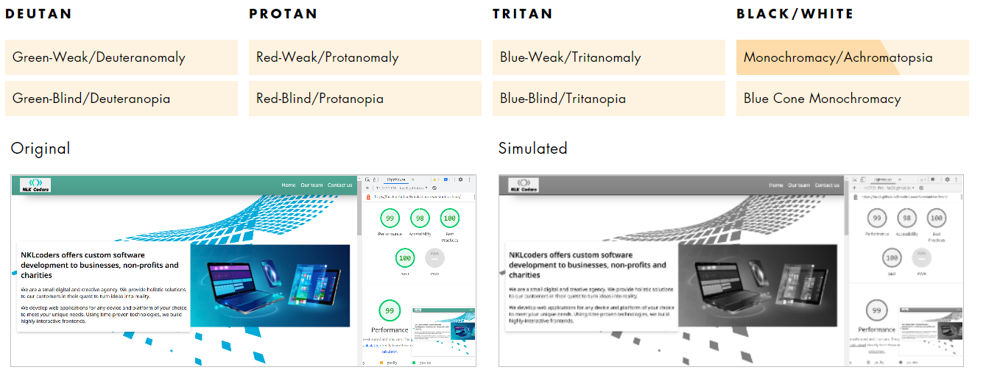
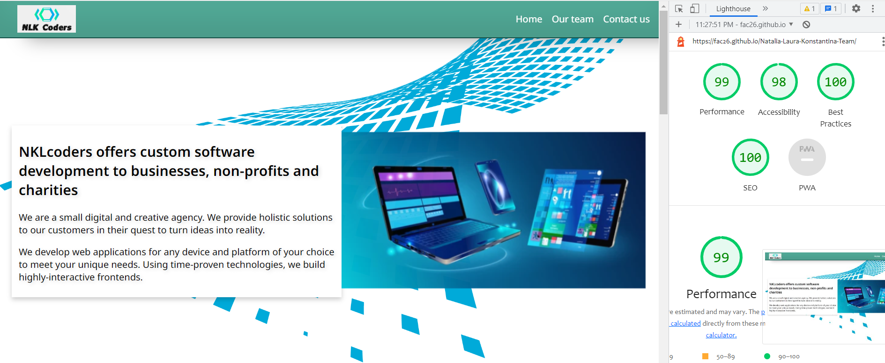
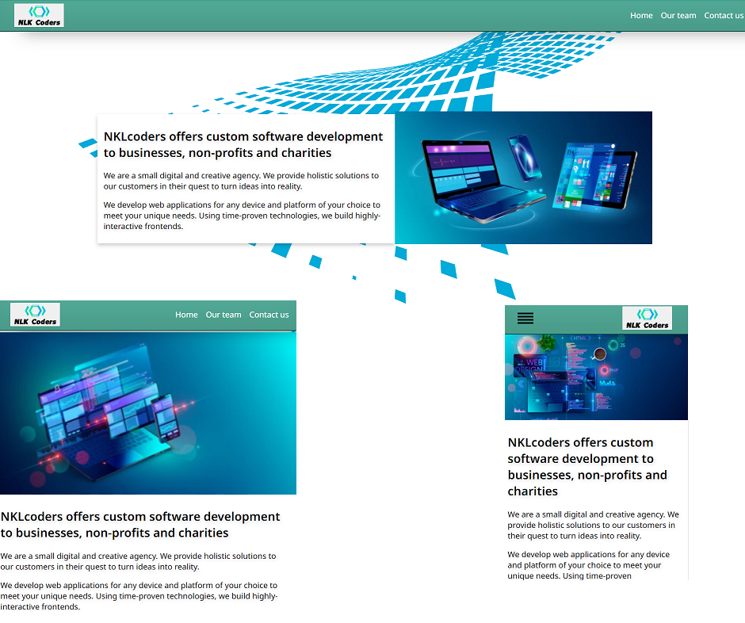

# Markup portfolio

## 1. Structure a site using semantic HTML to aid accessibility
  https://github.com/nataliarusu/a11y  
  When we write semantically correct HTML, we're letting the browser know what type of content it's dealing with and how that content relates to other content. Elements like div and span are for layout only. They’re semantically meaningless, they don’t have keyboard or touch support in any browser, and they don’t communicate anything to the accessibility API. For example, we should never use a div or span for a button when we could use a semantically meaningful button element.
When a screen-reader encounters an image, it will say “graphic” or “image” and then read the image’s alternative (“alt”) text. We should include descriptive alt text for all images, describing the image specifically but briefly. If we must use an image that has a lot of text in it, we should repeat the text in a caption below the image.   
  
    
      

## 2. Make a web page more readable for screen readers
[https://github.com/nataliarusu/a11y](https://github.com/nataliarusu/a11y/blob/main/index.html]
  We learned
  - we should avoid “click here” links or vague link names. Screen-reader users often use a keyboard shortcut to list all the links on a page. In such a list, the links have no surrounding text, so it’s important to make your link names descriptive. 

    <code>< a href="https://www.diffordsguide.com/cocktails/recipe/4258/old-friend">
       <  h3  >Old Friend< /h3 >
    < /a ></code>
      
    
 - we should use one h1 per page, matching the page title and do not skip heading levels when increasing, but we can skip levels when decreasing (h1, h2, h3, h2, h3, h4, h2, h3, h4).
 - underline links. Someone with monochromacy wouldn’t be able to differentiate between text and anchor text at all and would have to hover over the text to see if it their cursor changes to a pointer. 

## 3. Design a UI without relying solely on colour, so that we don’t exclude colour-blind users
  We used website tool to check colour clindness simulator on our website chttps://pilestone.com/pages/color-blindness-simulator-1  
  
  We checked all types of color blindness. There are eight types to experiment with under the four categories of color blindness: deutan, protan, tritan, and black/white. All tests showed no issues for blindness users to see the page.  

         

## 4. Ensure our UI has sufficient colour contrast so that everyone can perceive it comfortably
  Lighthouse developer tool on the browser 
  

## 5. Use various tools to check that a website meets accessibility criteria

  We used the Lighthouse developer tool on the browser which has audits for performance, accessibility, progressive web apps, SEO and more. We haven't used the axe DevTools but we are aware of Web Accessibility Testing extensions for browsers. For example: 
  axe DevTools - Web Accessibility Testing extention for chrome 
  https://chrome.google.com/webstore/detail/axe-devtools-web-accessib/lhdoppojpmngadmnindnejefpokejbdd

## 6. Ensure a website displays well on screens of different sizes

In this project, we use @media queries:

    @media screen and (max-width: 480px)
    @media screen and (max-width: 600px) 
    @media screen and (max-width: 768px)
  

## 7. Use CSS media queries to ensure content is always presented effectively 
  https://github.com/fac26/Natalia-Laura-Konstantina-Team/commit/481f2566942267f8f1e2a690ada28e0aa3c65cb8

      @media screen and (max-width: 480px) {
        #team > * + * {
          max-width: 100%;
        }
        }
      @media screen and (max-width: 600px) {
        .team-member{
          flex-direction: column;
        }
      }

## 8. Demonstrate a mobile-first approach to designing a website with a great user experience

Although we didn't build the website using the mobile-first approach, the code snippet below shows how we use the mobile-first approach in the second project. 
  https://github.com/fac26/Dominic_Natalia_http/blob/main/style.css
  
    #form-search-country input,
      .country-list {
        width: 70vw;
     }

    @media screen and (min-width: 600px) {
      #form-search-country input,
      .country-list {
        width: 40vw;
      }
    }
    

## 9. Create an attractive and accessible colour palette for a project
  https://github.com/nataliarusu/palette

## 10. Use CSS variables to apply repeated colours to HTML elements
  https://github.com/fac26/Natalia-Laura-Konstantina-Team/blob/main/style.css
  
    :root {
    --light-green: #52ab98;
    --dark-green: #155048;
    --main-link-hover: #7a2b52;
    }
